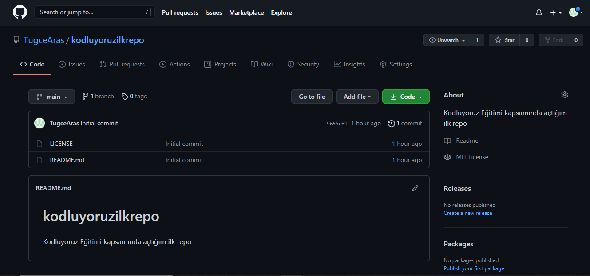

# **Kodluyoruz İlk Repo**



<br/><br/>
Bu repo <u>[Kodluyoruz](https://www.kodluyoruz.org/)</u> Front-End eğitiminde oluşturduğmuz ilk repo. İçerisinde bir adet README dosyası, bir adet de index.html barındırıyor.
<br/><br/>
## **Installation** 
<br/>
Öncelikle projeyi clonelayın. (Buraya sizin reponuzdan aldığınız link gelecek)
<br/><br/>
    
```

git clone https://github.com/TugceAras/kodluyoruzilkrepo.git    

```
<br/>

## **Usage**
<br/>
Projeyi cloneladıktan sonra Visual Studio Code programında açınız.
<br/><br/>
Linux için : 
<br/><br/>

```
cd kodluyoruzilkrepo
code.
``` 
<br/>

## **Contributing**
<br/>
Pull requestler kabul edilir. Büyük değişiklikller için , lütfen önce neyi değiştirmek istediğinizi tartışmak için bir konu açınız.
<br/><br/>

##  **License**
<br/>

<u> [MIT](https://choosealicense.com/licenses/mit/)
